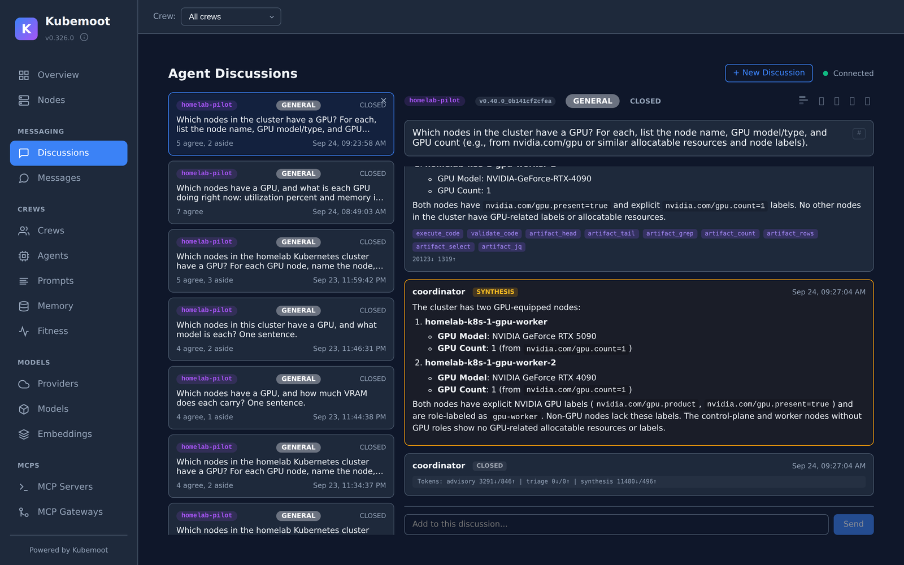

Claude Code speaks MCP over HTTP natively, so connecting it to the crew liaison is
one command. See [The Crew Liaison](../crew-liaison/) for what the tools do and why
the answer comes by ticket.

## Try it against any cluster you can reach

Port-forward the liaison's Service and add it as a local server:

```bash
kubectl -n kubemoot port-forward svc/kubemoot-operator-liaison 18080:80
claude mcp add --transport http kubemoot http://localhost:18080/mcp
```

Start a new Claude Code session and ask in plain language:

> Ask the homelab-pilot crew which nodes have a GPU.

Claude calls `list_crews` if it needs the name, then `ask`, then `get_answer` until
the crew has settled, and reports the answer. A crew takes one to several minutes;
each call returns within 45 seconds, and Claude Code moves the wait into a
background task past two minutes, so the session stays responsive.

While the ticket is pending, the operator's dashboard shows the moot itself: the
agents convened, each finding, and the synthesis arriving.

## From a script

The same works headless, for a demo, a check, or a CI step. An MCP config file names
the liaison, and `claude -p` runs one prompt with only that server and its tools
allowed:

```bash
cat > kubemoot-mcp.json <<'EOF'
{"mcpServers":{"kubemoot":{"type":"http","url":"http://localhost:18080/mcp"}}}
EOF

claude -p --mcp-config kubemoot-mcp.json --strict-mcp-config \
  --allowedTools "mcp__kubemoot__list_crews,mcp__kubemoot__ask,mcp__kubemoot__get_answer" \
  "Hey homelab-pilot crew, which nodes have a GPU?"
```

Claude Code polls the ticket for you and prints the crew's answer when it settles.

## What a session looks like

A real exchange against the reference homelab crew (an RTX 5090 node and an RTX 4090
node), run with the scripted command above. Claude Code turned the prompt into a
fuller question for the crew, polled the ticket three times, and printed this after
196 seconds:

> **Hey homelab-pilot crew, which nodes have a GPU?**
>
> The homelab-pilot crew says two nodes have a GPU:
>
> | Node | GPU | Count |
> |---|---|---|
> | homelab-k8s-1-gpu-worker | NVIDIA GeForce RTX 5090 | 1 |
> | homelab-k8s-1-gpu-worker-2 | NVIDIA GeForce RTX 4090 | 1 |
>
> They found this from the node labels. Both nodes are labeled
> `nvidia.com/gpu.present=true` with a matching `nvidia.com/gpu.product`, and both
> have the `gpu-worker` role. The control-plane and the other workers have no GPU
> labels or GPU resources.

Two things to notice. Claude Code never saw the agents: it saw `ask`, a few
`get_answer` calls, and one answer. And the caveats are the crew's own words, not a
summary made outside the cluster: a crew that flags what it could not verify, such as
a metrics source that came back empty, is a crew you can act on.

The same moot on the dashboard, five agreeing findings and two standing aside before
the synthesis:



## Through a public route

With `liaison.expose` on and a hostname routed to the cluster:

```bash
claude mcp add --transport http kubemoot https://moot.example.org/mcp \
  --header "Authorization: Bearer <token>"
```

Behind Cloudflare Access, send the service token headers instead:

```bash
claude mcp add --transport http kubemoot https://moot.example.org/mcp \
  --header "CF-Access-Client-Id: <id>" \
  --header "CF-Access-Client-Secret: <secret>"
```

## If a call times out anyway

Claude Code's default tool timeout is sixty seconds, above the liaison's 45-second
cap, so this should not happen. If your client is stricter, give the liaison its own
timeout in `.mcp.json`:

```json
{
  "mcpServers": {
    "kubemoot": {
      "type": "http",
      "url": "https://moot.example.org/mcp",
      "timeout": 120000
    }
  }
}
```

A retry of the same question rejoins the running discussion rather than starting a
second one, so a timed-out call costs nothing but the wait.
